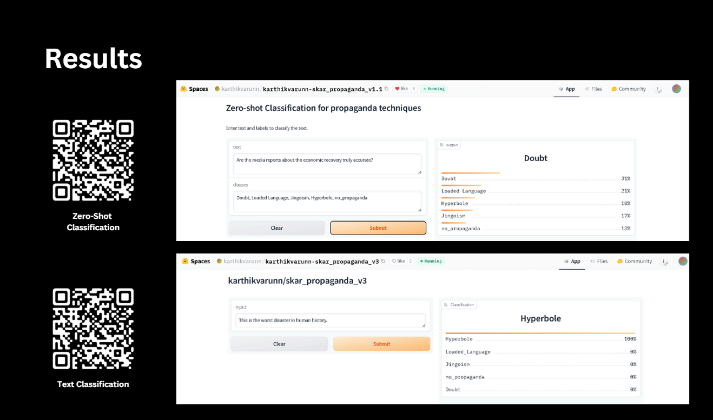

# Detecting-Propaganda-Techniques-in-News-Articles
- Preprocessed textual data from news articles and annotated propaganda techniques for analysis.
- Utilized Random Forest, CNN, and RNN models, analyzing model performance and addressing challenges in
classifying propaganda techniques.
- Fine-tuned Hugging Face models (distilbert-base-uncased and facebook/bart-large-mnli) for text and zero-shot
classification, achieving up to 89% accuracy.
- Deployed the fine-tuned models on Hugging Face and created Gradio spaces for both text and zero-shot
classification models.

